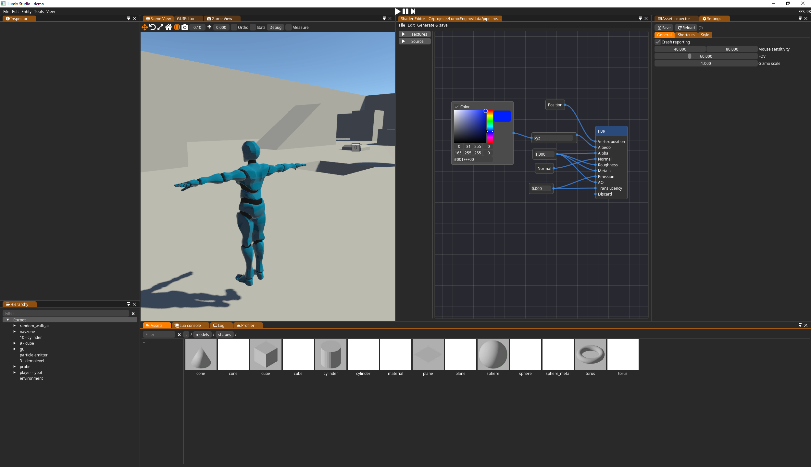

# Lumix Engine Shader Editor

Visual shader editor for [Lumix Engine](https://github.com/nem0/LumixEngine/)
[How to install this plugin](https://github.com/nem0/LumixEngine/wiki/available-plugins)

## See it in action on YouTube
* [Shield effect tutorial](https://www.youtube.com/watch?v=B-flQTi-CeA)
* [Dissolve effect tutorial](https://www.youtube.com/watch?v=7OcggtIH6sg)
* [Portal effect tutorial](https://www.youtube.com/watch?v=xXMm2oHM_fo)
