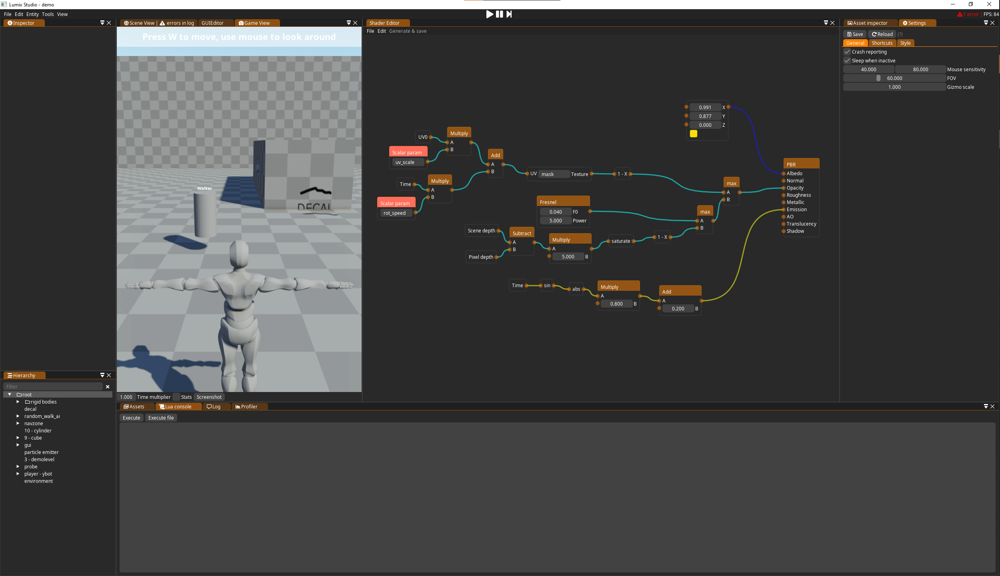

# Lumix Engine Shader Editor

[See it in action on YouTube](https://www.youtube.com/watch?v=5boX1AHPfdE&ab_channel=LumixEngine)

Visual shader editor for [Lumix Engine](https://github.com/nem0/LumixEngine/)

[How to install this plugin](https://github.com/nem0/LumixEngine/wiki/available-plugins)
